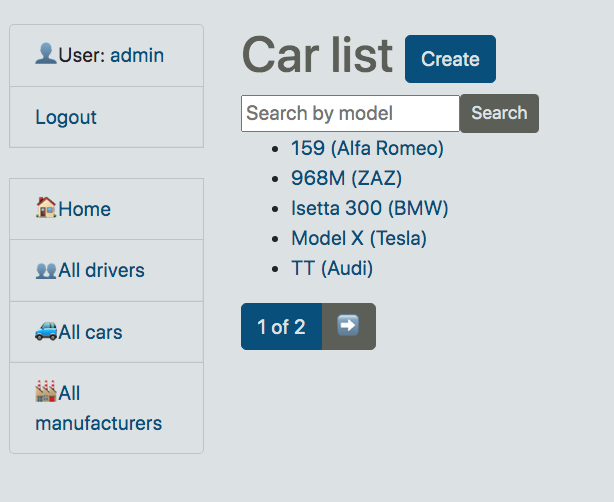

# taxi-service-kate

Django project of taxi service

## Check it out!

[Taxi service Deployed to Heroku](https://taxi-service-kate.herokuapp.com/)

* You can test this site!
* login: user
* password: user12345

## Installing

Python3 must be already installed

```shell
git https://github.com/katevasilenko/taxi-service-kate
cd taxi-service-kate
python -m venv venv
venv/scripts/activate
pip install -r requirements.txt
python manage.py runserver  # start Django project
```

## Features

* Authentication functionality for Driver/User
* Managing cars, drivers and manufacturers directly from website
* Powerful admin panel for advanced managing

## Demo


